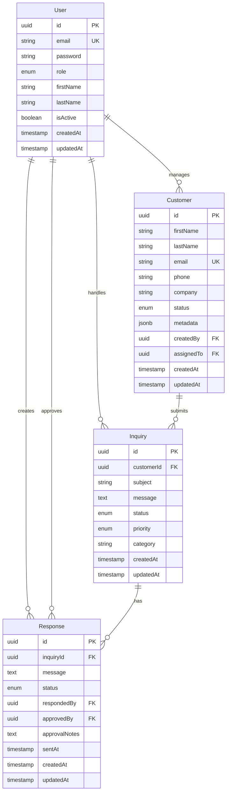

# Customer Nexus Hub - Backend Architecture Plan

## Backend Technology Stack

### Core Technologies
- **Runtime**: Node.js v20 LTS
- **Language**: TypeScript 5.x
- **Framework**: NestJS v10
- **Database**: PostgreSQL 15
- **ORM**: TypeORM 0.3.x
- **Cache**: Redis 7
- **Queue**: Bull (Redis-based)
- **API Docs**: Swagger/OpenAPI 3.0

### Development Tools
- **Package Manager**: pnpm
- **Testing**: Jest + Supertest
- **Linting**: ESLint
- **Formatting**: Prettier
- **Git Hooks**: Husky + lint-staged

## Database Design



## Module Architecture

### 1. Auth Module
```
src/modules/auth/
├── auth.controller.ts
├── auth.service.ts
├── auth.module.ts
├── strategies/
│   ├── jwt.strategy.ts
│   └── refresh-token.strategy.ts
├── guards/
│   ├── jwt-auth.guard.ts
│   ├── roles.guard.ts
│   └── refresh-token.guard.ts
├── decorators/
│   ├── current-user.decorator.ts
│   └── roles.decorator.ts
├── dto/
│   ├── login.dto.ts
│   ├── register.dto.ts
│   └── token.dto.ts
└── interfaces/
    └── jwt-payload.interface.ts
```

### 2. Customer Module
```
src/modules/customers/
├── customers.controller.ts
├── customers.service.ts
├── customers.module.ts
├── entities/
│   └── customer.entity.ts
├── dto/
│   ├── create-customer.dto.ts
│   ├── update-customer.dto.ts
│   ├── filter-customer.dto.ts
│   └── customer-response.dto.ts
└── interfaces/
    └── customer.interface.ts
```

### 3. Inquiry Module
```
src/modules/inquiries/
├── inquiries.controller.ts
├── inquiries.service.ts
├── inquiries.module.ts
├── entities/
│   └── inquiry.entity.ts
├── dto/
│   ├── create-inquiry.dto.ts
│   ├── update-inquiry.dto.ts
│   └── filter-inquiry.dto.ts
└── enums/
    ├── inquiry-status.enum.ts
    └── priority.enum.ts
```

### 4. Response Module
```
src/modules/responses/
├── responses.controller.ts
├── responses.service.ts
├── responses.module.ts
├── entities/
│   └── response.entity.ts
├── dto/
│   ├── create-response.dto.ts
│   ├── update-response.dto.ts
│   ├── approve-response.dto.ts
│   └── filter-response.dto.ts
└── enums/
    └── response-status.enum.ts
```

## API Endpoints Design

### Authentication Endpoints
```
POST   /api/v1/auth/register     - Register new user (Admin only)
POST   /api/v1/auth/login        - User login
POST   /api/v1/auth/refresh      - Refresh access token
POST   /api/v1/auth/logout       - Logout user
GET    /api/v1/auth/profile      - Get current user profile
PUT    /api/v1/auth/profile      - Update profile
```

### Customer Management Endpoints
```
GET    /api/v1/customers         - List customers (paginated, filtered)
GET    /api/v1/customers/:id     - Get customer details
POST   /api/v1/customers         - Create new customer
PUT    /api/v1/customers/:id     - Update customer
DELETE /api/v1/customers/:id     - Delete customer
POST   /api/v1/customers/:id/assign - Assign customer to CSO
```

### Inquiry Management Endpoints
```
GET    /api/v1/inquiries         - List inquiries (paginated, filtered)
GET    /api/v1/inquiries/:id     - Get inquiry details
POST   /api/v1/inquiries         - Create new inquiry
PUT    /api/v1/inquiries/:id     - Update inquiry
PATCH  /api/v1/inquiries/:id/status - Update inquiry status
```

### Response Management Endpoints
```
GET    /api/v1/responses         - List responses (filtered)
GET    /api/v1/responses/:id     - Get response details
POST   /api/v1/responses         - Create draft response
PUT    /api/v1/responses/:id     - Update response
POST   /api/v1/responses/:id/submit - Submit for approval
POST   /api/v1/responses/:id/approve - Approve response (Manager)
POST   /api/v1/responses/:id/reject - Reject response (Manager)
```

## Cross-Cutting Concerns Implementation

### 1. Error Handling
```typescript
// Global exception filter
@Catch()
export class AllExceptionsFilter implements ExceptionFilter {
  catch(exception: unknown, host: ArgumentsHost) {
    // Structured error response
  }
}
```

### 2. Logging
```typescript
// Request logging interceptor
@Injectable()
export class LoggingInterceptor implements NestInterceptor {
  intercept(context: ExecutionContext, next: CallHandler): Observable<any> {
    // Log request and response
  }
}
```

### 3. Validation
```typescript
// DTO validation with class-validator
export class CreateCustomerDto {
  @IsEmail()
  @IsNotEmpty()
  email: string;

  @IsString()
  @MinLength(2)
  firstName: string;
}
```

### 4. Pagination
```typescript
// Pagination helper
export class PaginationHelper {
  static paginate<T>(
    query: SelectQueryBuilder<T>,
    options: PaginationOptions,
  ): Promise<PaginatedResult<T>> {
    // Implementation
  }
}
```

## Security Implementation

### 1. Authentication Flow
```
1. User login with email/password
2. Validate credentials
3. Generate JWT access token (15min)
4. Generate refresh token (7days)
5. Store refresh token in Redis
6. Return tokens to client
```

### 2. Authorization Matrix
| Role    | Customers | Inquiries | Responses | Approval |
|---------|-----------|-----------|-----------|----------|
| CSO     | Read Own  | Read/Write| Create    | No       |
| Manager | Read All  | Read All  | Read All  | Yes      |
| Admin   | Full      | Full      | Full      | Yes      |

### 3. Security Headers
```typescript
// Helmet configuration
app.use(helmet({
  contentSecurityPolicy: {
    directives: {
      defaultSrc: ["'self'"],
      // Additional directives
    },
  },
}));
```

## Database Optimization

### 1. Indexes
```sql
-- Performance indexes
CREATE INDEX idx_customers_email ON customers(email);
CREATE INDEX idx_customers_assigned_to ON customers(assigned_to);
CREATE INDEX idx_inquiries_customer_id ON inquiries(customer_id);
CREATE INDEX idx_inquiries_status ON inquiries(status);
CREATE INDEX idx_responses_inquiry_id ON responses(inquiry_id);
CREATE INDEX idx_responses_status ON responses(status);
```

### 2. Connection Pooling
```typescript
// TypeORM configuration
{
  type: 'postgres',
  host: process.env.DB_HOST,
  port: process.env.DB_PORT,
  username: process.env.DB_USERNAME,
  password: process.env.DB_PASSWORD,
  database: process.env.DB_NAME,
  entities: ['dist/**/*.entity.js'],
  synchronize: false,
  logging: process.env.NODE_ENV === 'development',
  extra: {
    max: 20, // Pool size
    idleTimeoutMillis: 30000,
  },
}
```

## Testing Strategy

### 1. Unit Tests
```typescript
// Service test example
describe('CustomerService', () => {
  let service: CustomerService;
  let repository: Repository<Customer>;

  beforeEach(async () => {
    const module = await Test.createTestingModule({
      providers: [
        CustomerService,
        {
          provide: getRepositoryToken(Customer),
          useValue: mockRepository,
        },
      ],
    }).compile();

    service = module.get<CustomerService>(CustomerService);
  });

  it('should create a customer', async () => {
    // Test implementation
  });
});
```

### 2. Integration Tests
```typescript
// API endpoint test
describe('Customer Controller (e2e)', () => {
  let app: INestApplication;

  beforeAll(async () => {
    const moduleFixture = await Test.createTestingModule({
      imports: [AppModule],
    }).compile();

    app = moduleFixture.createNestApplication();
    await app.init();
  });

  it('/customers (GET)', () => {
    return request(app.getHttpServer())
      .get('/customers')
      .expect(200)
      .expect((res) => {
        expect(res.body).toHaveProperty('data');
        expect(res.body).toHaveProperty('meta');
      });
  });
});
```

## Environment Configuration

### Development (.env.development)
```env
NODE_ENV=development
PORT=3000

# Database
DB_HOST=localhost
DB_PORT=5432
DB_USERNAME=cnh_user
DB_PASSWORD=cnh_password
DB_NAME=cnh_db

# Redis
REDIS_HOST=localhost
REDIS_PORT=6379

# JWT
JWT_SECRET=your-jwt-secret
JWT_REFRESH_SECRET=your-refresh-secret
JWT_EXPIRATION=15m
JWT_REFRESH_EXPIRATION=7d

# Swagger
SWAGGER_ENABLED=true
```

### Production Considerations
```env
NODE_ENV=production
PORT=3000

# Use environment variables from secrets
DB_HOST=${DB_HOST}
DB_PORT=${DB_PORT}
DB_USERNAME=${DB_USERNAME}
DB_PASSWORD=${DB_PASSWORD}
DB_NAME=${DB_NAME}

# Redis cluster
REDIS_HOST=${REDIS_HOST}
REDIS_PORT=${REDIS_PORT}
REDIS_PASSWORD=${REDIS_PASSWORD}

# Security
CORS_ORIGIN=https://your-domain.com
RATE_LIMIT_TTL=60
RATE_LIMIT_LIMIT=100
```

## Performance Metrics

### Key Performance Indicators
- API response time < 200ms for read operations
- API response time < 500ms for write operations
- Database query optimization (N+1 prevention)
- Redis caching for frequently accessed data
- Connection pooling for database efficiency

### Monitoring Setup
```typescript
// Health check endpoint
@Controller('health')
export class HealthController {
  @Get()
  @HealthCheck()
  check() {
    return this.health.check([
      () => this.db.pingCheck('database'),
      () => this.redis.pingCheck('redis'),
    ]);
  }
}
```

## Deployment Strategy

### Docker Configuration
```dockerfile
# Backend Dockerfile
FROM node:20-alpine AS builder
WORKDIR /app
COPY package*.json pnpm-lock.yaml ./
RUN npm install -g pnpm && pnpm install --frozen-lockfile
COPY . .
RUN pnpm build

FROM node:20-alpine
WORKDIR /app
COPY --from=builder /app/dist ./dist
COPY --from=builder /app/node_modules ./node_modules
EXPOSE 3000
CMD ["node", "dist/main"]
```

### CI/CD Pipeline
```yaml
# GitHub Actions workflow
name: Backend CI/CD

on:
  push:
    branches: [main, develop]
  pull_request:
    branches: [main]

jobs:
  test:
    runs-on: ubuntu-latest
    steps:
      - uses: actions/checkout@v2
      - name: Setup Node.js
        uses: actions/setup-node@v2
        with:
          node-version: '20'
      - name: Install dependencies
        run: pnpm install
      - name: Run tests
        run: pnpm test
      - name: Run e2e tests
        run: pnpm test:e2e